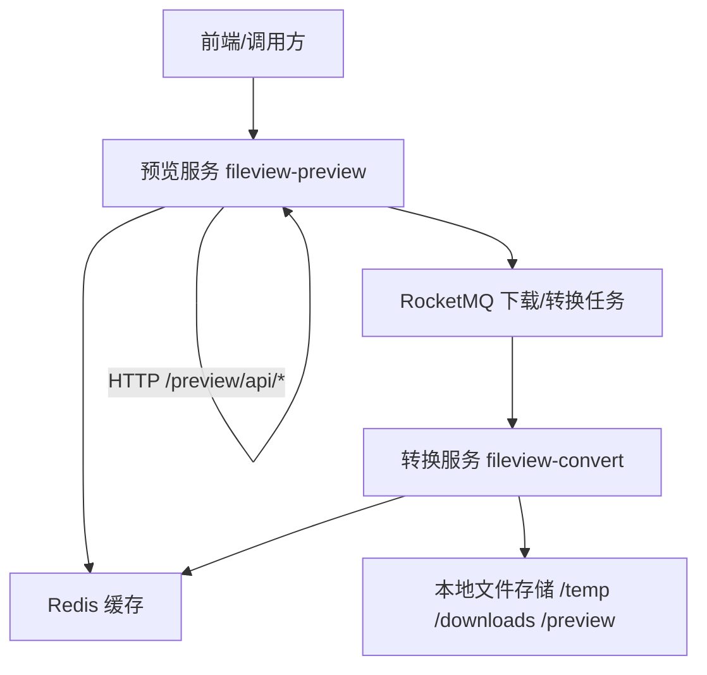

<div align="center">
  <h1> BaseMetas Fileview 在线文件预览引擎-服务端项目</h1>
  <p>新一代通用型在线文件预览引擎，全格式覆盖，跨平台，零依赖</p>
  <a href="https://hub.docker.com/r/basemetas/fileview/tags"></a>
  <a href="https://github.com/BaseMetas/fileview/blob/main/LICENSE"></a>
  <a href="https://hub.docker.com/r/basemetas/fileview/tags"></a>
  <a href="https://github.com/BaseMetas/fileview-backend/graphs/contributors"></a>
  <a href="https://github.com/BaseMetas/fileview-backend/commits"></a>
  <a href="https://github.com/BaseMetas/fileview-backend"></a>
</div>

## 主项目仓库

https://github.com/BaseMetas/fileview

## 文件预览转换服务（FileView Backend）

### 项目简介

文件预览转换服务是一个基于 Spring Boot 的后端项目，用于提供**多格式文档的在线预览与转换能力**。项目采用**预览服务（Preview）+ 转换服务（Convert）**的双服务架构，通过 Redis 和 RocketMQ 协同工作，适合作为企业文档中心、在线预览网关等场景的后端能力组件。

---

### 功能特性概览

- **统一预览入口（fileview-preview 模块）**：
  - 支持本地/服务器文件预览
  - 支持网络 URL 文件下载后预览
  - 支持智能轮询 / 长轮询查询转换状态
  - 支持加密 Office / 压缩包的密码校验与交互式解锁
  - 支持 EPUB 在线阅读资源服务
- **统一转换引擎（fileview-convert 模块）**：
  - 支持 Word / Excel / PPT / PDF / OFD 等常见办公文档转换
  - 集成 LibreOffice + OFDRW 等引擎
  - 通过 RocketMQ 异步消费转换任务，提升吞吐能力
  - 提供引擎健康检查与状态报告
- **缓存与存储**：
  - 使用 Redis 存储转换结果与预览缓存
  - 支持下载文件、解压目录、转换结果、多页文件目录等本地存储隔离
- **可观测性与调优**：
  - 基于 Spring Boot Actuator 的健康检查端点
  - 关键链路（下载、队列等待、转换、轮询）已埋点日志，便于排查性能问题

---

### 系统架构概览



- **预览服务（Preview）**：对外暴露 HTTP 接口，负责：
  - 接收预览请求（本地文件 / 网络文件）
  - 发起下载任务、轮询转换结果
  - 读取 Redis 中由转换服务写入的转换结果
- **转换服务（Convert）**：对外仅暴露少量管理接口，主要职责：
  - 消费 RocketMQ 中的文件转换事件
  - 调用多种文档引擎执行实际转换
  - 将转换结果写入 Redis + 文件系统，供预览服务读取

---

### 模块结构

- **根工程 `fileview-backend`**（打包/依赖聚合）：
  - Maven 父 POM（`pom.xml`），统一管理 Spring Boot / Spring Cloud / RocketMQ / BouncyCastle 等依赖版本
  - 管理两个子模块：`fileview-convert`、`fileview-preview`
  - 提供一键部署脚本 `deploy.sh`、`docker-compose.yml` 等

- **`fileview-preview`（文件预览服务）**：
  - 启动类：`com.fileview.preview.FilePreviewApplication`
  - 默认端口：`8184`
  - 主要职责：
    - 预览请求入口（本地文件 / 网络 URL）
    - 下载任务管理与状态查询
    - 与 Redis 交互读取转换结果
    - EPUB 资源服务、密码解锁等增强能力

- **`fileview-convert`（文件转换服务）**：
  - 启动类：`com.fileview.convert.FileConvertApplication`
  - 默认端口：`8183`
  - 主要职责：
    - 统一的文件转换 HTTP 入口（本地文件）
    - 将转换请求封装为事件并发送到 RocketMQ
    - 消费转换事件，调用各类引擎执行转换
    - 将转换结果写入 Redis 与本地存储

---

### 运行环境要求（简版）

> 完整部署说明请参考项目根目录的 `DEPLOYMENT.md` 文档。

- **基础环境**：
  - Java 17+
  - Maven 3.8+
- **外部服务**：
  - Redis 6.0+（缓存与状态存储）
  - RocketMQ 5.0+（异步任务队列）
- **转换引擎（视业务启用情况）**：
  - LibreOffice 7.0+：Office 文档转换
  - OFDRW：OFD 转 PDF 等
  - ImageMagick / CAD2X / 等可选引擎
- **字体与文件系统**：
  - 建议挂载中文字体目录到容器 `/usr/share/fonts`
  - 为 `/opt/fileview/data` 等目录预留足够磁盘空间

---

### 快速开始（开发环境）

#### 1. 使用 Docker 容器一键启动开发环境

仓库提供 `docker-compose.yml`，包含：
- 开发容器（`moqisoft/baseimage`）
- 映射端口：
  - `8183`：转换服务 HTTP 端口
  - `8184`：预览服务 HTTP 端口
  - `6379`：Redis

在项目根目录执行：

```bash
# 启动开发容器
docker compose up -d dev-env

# 进入容器
docker exec -it fileview-backend bash

# 容器内构建并部署（参考 DEPLOYMENT.md）
./deploy.sh
```

#### 2. 本地直接运行（无容器）

```bash
# 1）拉取依赖并打包（根目录）
./mvnw clean package -DskipTests

# 2）启动转换服务（默认 8183）
cd fileview-convert/target/lib
java -jar fileview-convert-1.0.0.jar \
  --spring.config.additional-location=../config/

# 3）启动预览服务（默认 8184）
cd fileview-preview/target/lib
java -jar fileview-preview-1.0.0.jar \
  --spring.config.additional-location=../config/
```

> 注意：本地运行前需确保 Redis、RocketMQ、LibreOffice 等外部依赖已正确安装并可访问。

---

### 核心接口概览

#### 预览服务（`fileview-preview`，端口默认 `8184`）

- **健康检查**
  - `GET /preview/api/health`
  - 返回服务状态、版本号、时间戳等基础信息。

- **本地/服务器文件预览**
  - `POST /preview/api/localFile`
  - 请求体：`FilePreviewRequest`（包含 `fileId` / 本地路径 / 预览类型 等）
  - 行为：发起预览流程，内部可能直接命中缓存或触发转换。

- **网络文件预览**
  - `POST /preview/api/netFile`
  - 请求体：`FilePreviewRequest`（包含 `networkFileUrl` 等）
  - 行为：先下载网络文件，再进入统一转换与预览流程。

- **预览状态长轮询**
  - `POST /preview/api/status/poll`
  - 请求体：`PollingRequest`（`fileId`、目标格式、超时与轮询间隔等）
  - 行为：服务端长轮询 Redis 与下载任务状态，返回 SUCCESS / FAILED / CONVERTING / DOWNLOADING 等统一状态。

- **加密文件密码解锁**
  - `POST /preview/api/password/unlock`
    - 请求体：`{"password": "...", "originalFilePath": "..."}`
    - 请求头：`X-Client-Id: <uuid>`
    - 行为：验证密码并在通过后为当前客户端标记解锁状态。
  - `GET /preview/api/password/status?fileId=xxx`
    - 行为：查询当前客户端对指定文件是否已解锁。

- **EPUB 资源访问**
  - `POST /preview/api/epub/resource`
    - 请求体：`{"fileId": "preview_xxx", "resourcePath": "META-INF/container.xml"}`
  - `GET /preview/api/epub/{fileId}/**`
    - 用于 EPUB 阅读器（如 `epub.js`）按路径访问内部资源。

#### 转换服务（`fileview-convert`，端口默认 `8183`）

- **健康检查**
  - `GET /convert/api/health`
- **引擎健康报告**
  - `GET /convert/api/engine/health`
  - 返回 ImageMagick 等引擎的可用性与报告字符串。

- **本地文件转换入口**
  - `POST /convert/api/srvFile`
  - 请求体：`BaseConvertRequest`（包含 `fileId`、`filePath`、`targetFormat` 等）
  - 行为：
    - 验证参数与文件路径
    - 封装为 `FileEvent` 发送到 RocketMQ
    - 由后台消费者执行实际转换并写入 Redis + 文件系统

> 提示：在典型部署中，**业务系统只需要直接调用预览服务**（`fileview-preview`），转换服务通过 MQ 与预览服务协作，无需直接暴露给外部用户。

---

### 构建与部署

- **构建命令**（根目录）：
  - `./mvnw clean package -DskipTests`
- **推荐部署方式**：
  - 使用根目录提供的 `deploy.sh` 一键构建并生成标准目录结构：
    - `bin/`：启动/停止脚本与外部引擎
    - `config/preview`、`config/convert`：外部化配置
    - `lib/preview`、`lib/convert`：应用 JAR
    - `logs/`：日志输出
    - `data/`：下载/预览/转换等运行期数据
- **详细说明**：
  - 请参考根目录的 `DEPLOYMENT.md`，其中包含：
    - 完整环境依赖
    - 目录结构示例
    - 启动/停止脚本使用方法
    - 健康检查与问题排查指南

---

### 配置要点（概览）

> 具体配置项请查看各模块的 `src/main/resources/application*.yml`。

- **Redis**：
  - 用于缓存转换结果、预览信息、EPUB 解压路径等
  - 已在代码中优化连接池与冷启动预热，减少首次访问延迟
- **RocketMQ**：
  - 用于预览服务与转换服务之间的事件通知（下载任务 / 转换任务 / 转换完成事件）
- **存储目录**（预览服务典型配置）：
  - `fileTemp/downloads`：下载文件
  - `fileTemp/source/uncompress`：EPUB 等解压目录
  - `fileTemp/preview`：转换后用于预览的文件
- **转换引擎配置**：
  - LibreOffice 监听的端口 / 进程数量
  - 外部引擎（如 CAD2X、ImageMagick）的二进制路径

---

### 开发与贡献

- 建议使用 IDE（IntelliJ IDEA / Eclipse）直接导入 Maven 工程：
  - 根模块：`fileview-backend`
  - 子模块：`fileview-preview`、`fileview-convert`
- 单元测试：
  - 预览服务测试位于：`fileview-preview/src/test/java/...`
  - 转换服务测试位于：`fileview-convert/src/test/java/...`
- 欢迎社区开发者参与：
  - 新增文件格式支持
  - 优化下载与转换性能
  - 完善监控与告警
  - 提供更多存储/网盘适配器

---

### 许可证

本项目源码文件头部已统一添加 **Apache License, Version 2.0** 声明，整体亦遵循 Apache-2.0 开源许可证。

> 使用、修改和分发本项目时，请遵守 Apache License 2.0 的相关条款。